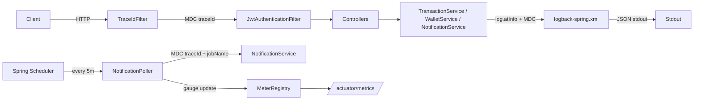

# Requirements

### Overview & Goals

Add first-class structured observability to the Cross-Pesa Spring Boot monolith so every HTTP request and every scheduled background cycle produces JSON logs with a stable `traceId`, and operational health of the notification poller becomes visible through Actuator/Micrometer.

### Scope

**In scope**

- Spring Boot Actuator with a locked-down endpoint whitelist.
- Logback JSON console appender via `logstash-logback-encoder`, with a human-readable fallback for `local` / `dev` profiles.
- MDC-based `traceId` for HTTP requests (servlet filter).
- MDC-based `traceId` + `jobName` for a `@Scheduled` notification poller, plus per-item try/catch so one bad notification doesn't kill the batch.
- Structured key-value logging in `TransactionService`, `WalletService` (this project's "AccountService" — see Technical Design), and `NotificationService`.
- Micrometer gauge `notification_poll_last_success_timestamp` and `@Timed` on the scheduled method.

**Out of scope**

- Distributed tracing (OpenTelemetry, Zipkin, Sleuth). We only correlate within a single JVM.
- Log shipping / ELK stack setup — we only produce JSON on stdout.
- Changing business logic in `TransactionService` / `WalletService` beyond swapping log calls.
- Refactoring the existing `TransactionSettlementWorker` @Scheduled (not part of the notification pipeline).

### Functional Requirements

1. Hitting any HTTP endpoint produces JSON log lines that all carry the same `traceId` MDC field for that request.
2. Each notification poller cycle produces JSON log lines carrying a distinct `traceId` and `jobName="notification-poll"`.
3. A thrown exception during one notification's dispatch inside a cycle does **not** stop subsequent notifications in the same cycle from being attempted.
4. A thrown exception at cycle level does **not** kill future scheduled runs — the schedule keeps ticking.
5. `/actuator/health`, `/actuator/metrics`, `/actuator/scheduledtasks`, `/actuator/loggers`, `/actuator/httpexchanges` return valid responses; `/actuator/env` and `/actuator/beans` are NOT exposed.
6. `/actuator/health` details are shown only to authorized principals (`when-authorized`).
7. `/actuator/metrics/notification_poll_last_success_timestamp` returns a monotonically increasing epoch-second gauge updated at the end of every successful cycle.
8. No plaintext PII (email, phone number, ID numbers) appears in the new structured fields — only surrogate ids (`userId`, `notificationId`, `transactionId`).

### Non-Functional Requirements

- No measurable throughput regression on the transaction hot path (structured logging cost only, no synchronous I/O added).
- The filter must always clear MDC in a `finally` block to prevent traceId leakage across thread-pool reuse.
- JSON layout must remain parseable by standard Logstash / Loki / CloudWatch JSON parsers (LogstashEncoder default).

# Technical Design

### Current Implementation

Relevant facts discovered in the codebase:

- Spring Boot **4.1.0**, Java 21, packaging via Maven (`pom.xml`).
- Modules under `com.manuelorg.cross_pesa`: `auth`, `wallet`, `transaction`, `notification`, `payment`, `ledger`, `admin`, `kycSubmission`, `rates`, `beneficiaries`, `systemEngine`, plus a `config/` package (holds `SecurityConfig`, `WebConfig`, `JwtAuthenticationFilter`, etc.).
- **No Actuator dependency and no `logback-spring.xml` exist yet** — logging is default Spring Boot console output.
- **The task refers to "AccountService", but the codebase's "accounts (wallets)" module is `wallet/`**, with `WalletService` at `src/main/java/com/manuelorg/cross_pesa/wallet/service/WalletService.java`. We will treat `WalletService` as the AccountService for this task and note this explicitly.
- **The task assumes a notification `@Scheduled` poller running every 5 minutes exists — it does not.** Grep of `@Scheduled` project-wide returns only `TransactionSettlementWorker.processPendingSettlements()` (fixedDelay=30000). We will therefore **create** the notification poller as part of this plan, matching the shape the task expects.
- `NotificationService` (`notification/service/NotificationService.java`) already has dispatch logic (`sendAfricasTalkingSms`, `sendSendGridEmail`) and uses `@Slf4j`. `Notification` entity has `NotificationStatus` (enum) and an idempotency key.
- Existing log statements use string-concat style like `log.info("Cross-Border Remittance initiated: {} {} → {} (tx={})", ...)` — these are the ones to convert.
- `SecurityConfig` will need to permit `/actuator/health` (public) and restrict others to authenticated / admin users; existing pattern uses HttpSecurity `authorizeHttpRequests` (as seen from `SecurityConfig.java` in `config/`).

### Key Decisions

1. **Poller location: create a new `NotificationPoller` @Component in `notification/service/`** rather than annotating a method on `NotificationService`. Rationale: mirrors the existing pattern (`TransactionSettlementWorker` is a separate component from `TransactionSettlementService`), keeps scheduling concerns out of the domain service, and avoids self-invocation issues around `@Timed` / `@Transactional`.
2. **"AccountService" ≡ `WalletService`.** The task's naming does not match the codebase; wallets are the customer account abstraction here. We will not create a new AccountService.
3. **Trace ID format: 8-char UUID prefix** (`UUID.randomUUID().toString().substring(0, 8)`). Rationale: short, human-scannable, low collision within a single JVM's observation window.
4. **Profile-based appender selection via `<springProfile>` inside `logback-spring.xml`.** Rationale: this is exactly what `logback-spring.xml` (vs plain `logback.xml`) enables — Boot activates it before profiles resolve.
5. **New package `com.manuelorg.cross_pesa.config.observability`** for the trace filter and any Micrometer bean config. Rationale: the constraint says "don't introduce new top-level packages beyond a logging/observability config package if needed" — putting it under existing `config/` keeps it consistent with `SecurityConfig`, `WebConfig`, etc.
6. **Poller poll query = `NotificationRepository.findByStatus(NotificationStatus.PENDING, PageRequest.of(0, 100))`.** Rationale: identical batch pattern to `TransactionSettlementWorker`. If that repository method does not yet exist, add a derived query — no schema change.
7. **Actuator security: `/actuator/health` public (liveness/readiness style), everything else authenticated + admin-role.** Rationale: matches the existing Security posture and satisfies the constraint that `/env` and `/beans` must not be publicly exposed (they are excluded from the whitelist entirely, so even authenticated calls 404).

### Proposed Changes

**1. `pom.xml` — add dependencies**

```xml
<dependency>
    <groupId>org.springframework.boot</groupId>
    <artifactId>spring-boot-starter-actuator</artifactId>
</dependency>
<dependency>
    <groupId>net.logstash.logback</groupId>
    <artifactId>logstash-logback-encoder</artifactId>
    <version>7.4</version>
</dependency>
```

Actuator brings in Micrometer core transitively; no separate Micrometer dep is needed.

**2. `src/main/resources/application.yaml` — Actuator config**

```yaml
management:
  endpoints:
    web:
      exposure:
        include: health,metrics,loggers,httpexchanges,scheduledtasks
        exclude: env,beans
  endpoint:
    health:
      show-details: when-authorized
  httpexchanges:
    recording:
      include: request-headers,response-headers,principal,remote-address,session-id,time-taken
```

**3. `src/main/resources/logback-spring.xml` — NEW**

JSON console appender via `LogstashEncoder`, active for all profiles except `local` / `dev`; those profiles use a human-readable pattern. LogstashEncoder already emits MDC fields as top-level JSON keys, so `traceId` and `jobName` appear automatically.

```xml
<configuration>
    <appender name="JSON_CONSOLE" class="ch.qos.logback.core.ConsoleAppender">
        <encoder class="net.logstash.logback.encoder.LogstashEncoder">
            <includeMdcKeyName>traceId</includeMdcKeyName>
            <includeMdcKeyName>jobName</includeMdcKeyName>
        </encoder>
    </appender>

    <appender name="HUMAN_CONSOLE" class="ch.qos.logback.core.ConsoleAppender">
        <encoder>
            <pattern>%d{HH:mm:ss.SSS} [%thread] %-5level [traceId=%X{traceId:-} jobName=%X{jobName:-}] %logger{36} - %msg%n</pattern>
        </encoder>
    </appender>

    <springProfile name="local,dev">
        <root level="INFO"><appender-ref ref="HUMAN_CONSOLE"/></root>
    </springProfile>
    <springProfile name="!local &amp; !dev">
        <root level="INFO"><appender-ref ref="JSON_CONSOLE"/></root>
    </springProfile>
</configuration>
```

**4. `config/observability/TraceIdFilter.java` — NEW**

```java
@Component
@Order(Ordered.HIGHEST_PRECEDENCE)
public class TraceIdFilter extends OncePerRequestFilter {
    public static final String MDC_KEY = "traceId";
    @Override
    protected void doFilterInternal(HttpServletRequest req, HttpServletResponse res, FilterChain chain)
            throws ServletException, IOException {
        String traceId = UUID.randomUUID().toString().substring(0, 8);
        MDC.put(MDC_KEY, traceId);
        res.setHeader("X-Trace-Id", traceId);
        try { chain.doFilter(req, res); }
        finally { MDC.remove(MDC_KEY); }
    }
}
```

Registered ahead of `JwtAuthenticationFilter` via `@Order(HIGHEST_PRECEDENCE)` so auth-failure logs also carry a traceId.

**5. `notification/service/NotificationPoller.java` — NEW**

```java
@Slf4j
@Component
@RequiredArgsConstructor
public class NotificationPoller {

    private final NotificationRepository notificationRepository;
    private final NotificationService notificationService;
    private final AtomicLong lastSuccessTimestamp = new AtomicLong(0);

    @PostConstruct
    void bindGauge(MeterRegistry registry) {
        Gauge.builder("notification_poll_last_success_timestamp", lastSuccessTimestamp, AtomicLong::get)
             .description("Epoch seconds of last successful notification poll cycle")
             .register(registry);
    }

    @Timed(value = "notification_poll_duration", description = "Notification poll cycle duration")
    @Scheduled(fixedDelayString = "PT5M")
    public void poll() {
        String traceId = UUID.randomUUID().toString().substring(0, 8);
        MDC.put("traceId", traceId);
        MDC.put("jobName", "notification-poll");
        long start = System.currentTimeMillis();
        int processed = 0, success = 0, failure = 0;
        try {
            log.atInfo().addKeyValue("trigger", "scheduler").log("Notification poll cycle started");
            List<Notification> batch = notificationRepository.findByStatus(NotificationStatus.PENDING, PageRequest.of(0, 100));
            for (Notification n : batch) {
                processed++;
                try {
                    notificationService.dispatch(n);   // existing dispatch entrypoint (or equivalent)
                    success++;
                } catch (Exception itemEx) {
                    failure++;
                    log.atError()
                       .addKeyValue("notificationId", n.getId())
                       .setCause(itemEx)
                       .log("Notification dispatch failed; continuing batch");
                }
            }
            lastSuccessTimestamp.set(Instant.now().getEpochSecond());
            log.atInfo()
               .addKeyValue("processedCount", processed)
               .addKeyValue("successCount", success)
               .addKeyValue("failureCount", failure)
               .addKeyValue("durationMs", System.currentTimeMillis() - start)
               .log("Notification poll cycle finished");
        } catch (Exception cycleEx) {
            log.atError().setCause(cycleEx).log("Notification poll cycle failed; schedule continues");
        } finally {
            MDC.remove("traceId");
            MDC.remove("jobName");
        }
    }
}
```

**6. `@EnableScheduling`** — verify it is on the main `CrossPesaApplication` class or a config; if missing, add to a `SchedulingConfig` in `config/` (the existing `TransactionSettlementWorker` @Scheduled implies it's already enabled — confirm and reuse).

**7. Structured logging swaps (log statements only — no logic changes)**

Example rewrites:

```java
// TransactionService.java line ~128 — BEFORE
log.info("Cross-Border Remittance initiated: {} {} → {} (tx={})",
         quote.amountSent(), request.sourceCurrency(), request.destinationCurrency(), savedTransaction.getId());

// AFTER
log.atInfo()
   .addKeyValue("event", "remittance.initiated")
   .addKeyValue("transactionId", savedTransaction.getId())
   .addKeyValue("userId", currentUserId)
   .addKeyValue("amount", quote.amountSent())
   .addKeyValue("sourceCurrency", request.sourceCurrency())
   .addKeyValue("destinationCurrency", request.destinationCurrency())
   .log("Cross-border remittance initiated");
```

Same pattern applied to:

- `TransactionService`: the two `log.info(...)` sites at lines ~128 and ~208.
- `WalletService`: lines ~60, ~82, ~124 (`user provisioned`, `duplicate gateway reference`, `credited retail wallet`).
- `NotificationService`: `log.warn("Notification already processed for key")` (line 62), `log.error("Failed to dispatch notification")` (line 104), `log.error("Failed to update retry count")` (line 119). **Do not** log the phone number in `sendAfricasTalkingSms` — replace with `notificationId` only (PII constraint).

**8. `SecurityConfig` — allow Actuator**

```java
.requestMatchers("/actuator/health").permitAll()
.requestMatchers("/actuator/**").hasRole("ADMIN")
```

(Placed before existing `.anyRequest().authenticated()`.)

### Data Models / Contracts

- New MDC keys: `traceId` (all logs), `jobName` (scheduler logs only).
- New response header on all HTTP responses: `X-Trace-Id`.
- New Micrometer metric: `notification_poll_last_success_timestamp` (Gauge, epoch seconds).
- New Micrometer timer: `notification_poll_duration` (from `@Timed`).
- No DB schema changes.

### Components

| Component | Type | Change |
|---|---|---|
| `pom.xml` | Build | Add Actuator + logstash-logback-encoder |
| `application.yaml` | Config | Add `management.*` block |
| `resources/logback-spring.xml` | New | JSON + human appenders with profile switch |
| `config/observability/TraceIdFilter` | New | Servlet filter, MDC per request |
| `config/SecurityConfig` | Modified | Allow `/actuator/health` public, others admin |
| `notification/service/NotificationPoller` | New | @Scheduled every 5min, MDC, per-item try/catch, gauge |
| `notification/repository/NotificationRepository` | Possibly modified | Add `findByStatus(NotificationStatus, Pageable)` if absent |
| `notification/service/NotificationService` | Modified | Structured logs; expose a `dispatch(Notification)` entrypoint if not already public |
| `transaction/service/TransactionService` | Modified | Structured logs only |
| `wallet/service/WalletService` | Modified | Structured logs only |

### File Structure

```
src/main/
├── java/com/manuelorg/cross_pesa/
│   ├── config/
│   │   ├── SecurityConfig.java                     (modified)
│   │   └── observability/
│   │       └── TraceIdFilter.java                  (new)
│   ├── notification/
│   │   └── service/
│   │       ├── NotificationPoller.java             (new)
│   │       └── NotificationService.java            (modified — structured logs)
│   ├── transaction/service/TransactionService.java (modified — structured logs)
│   └── wallet/service/WalletService.java           (modified — structured logs)
└── resources/
    ├── application.yaml                            (modified — management.*)
    └── logback-spring.xml                          (new)
```

### Architecture Diagram



### Risks

- **MDC leakage across threads**: mitigated by the `finally` blocks in both the filter and the poller. Reactive/async offloads are not currently used in these code paths, so no `TaskDecorator` needed yet.
- **Actuator exposure regression**: `/actuator/env` and `/actuator/beans` are explicitly excluded and also gated by `hasRole(ADMIN)`. Confirm no reverse proxy inadvertently exposes them.
- **Missing `@EnableScheduling`**: `TransactionSettlementWorker` already runs, so scheduling is enabled — but confirm during implementation.
- **`NotificationService.dispatch` visibility**: the poller needs a public entrypoint on `NotificationService` that dispatches a single `Notification`. If the current dispatch is `private`, promote it or add a thin public method — this is the one small logic-adjacent change permitted by the constraint ("do not change business logic") because it merely exposes an existing capability.
- **`logstash-logback-encoder` version compatibility with Boot 4 / Logback 1.5.x**: version 7.4 targets Logback 1.4/1.5 and is compatible; verify at build time.

# Testing

### Validation Approach

Manual smoke + targeted integration checks. The change is largely cross-cutting logging + config, so verification is by observing log output, `/actuator/*` responses, and one deliberate fault-injection in the poller.

### Key Scenarios

1. **HTTP traceId propagation** — call `GET /api/v1/wallets/...` (or any authenticated endpoint), then grep the stdout JSON for the `traceId` field: all lines from that request share the same value, and the response contains an `X-Trace-Id` header matching it.
2. **Poller cycle logs** — wait 5 minutes (or temporarily lower `fixedDelayString` to `PT30S`) and confirm two JSON log lines appear with `jobName="notification-poll"`, a shared `traceId`, and the end line includes `processedCount`, `successCount`, `failureCount`, `durationMs`.
3. **Actuator whitelist** — `GET /actuator/health` (200, no details unless authenticated), `GET /actuator/metrics/notification_poll_last_success_timestamp` (200 with a numeric `value`), `GET /actuator/scheduledtasks` (200 listing the poller), `GET /actuator/env` (404 — not exposed), `GET /actuator/beans` (404 — not exposed).
4. **Profile switch** — start with `SPRING_PROFILES_ACTIVE=local` → human-readable pattern; start with no profile or `prod` → JSON output.

### Edge Cases

- **Bad notification in the middle of a batch**: temporarily insert `if (n.getId() == someId) throw new RuntimeException("boom");` inside the poller loop; confirm the error line is logged with `notificationId=<id>` and the remaining notifications in the batch still get processed (`processedCount` in the end line equals the batch size, `failureCount >= 1`).
- **Uncaught cycle-level exception**: throw a `RuntimeException` before the loop begins; verify the schedule keeps firing on the next tick (poller isn't silently killed).
- **MDC cleanup**: after an HTTP request finishes, subsequent log lines emitted by unrelated background threads must NOT include the request's `traceId` — verified by comparing sequential requests and background logs.
- **PII check**: grep the JSON output during test scenarios for the raw phone number / email used in test data; expected result is zero hits in `NotificationService`-emitted lines (only `notificationId` should appear).

### Test Changes

No new unit tests added for pure logging swaps. Add one small integration-style check only if easy:

- `TraceIdFilterTest` (MockMvc): perform any request, assert the response has `X-Trace-Id` and that MDC is empty after the call.
- `NotificationPollerTest`: verify the loop-level try/catch by mocking `notificationService.dispatch` to throw for one element and succeed for others.

# Delivery Steps

### ✓ Step 1: Add Actuator + logstash-logback-encoder dependencies and Actuator config
The app boots with Actuator enabled and exposes the whitelisted endpoints only.

- Add `spring-boot-starter-actuator` and `net.logstash.logback:logstash-logback-encoder:7.4` to `pom.xml`.
- Add a `management:` block to `src/main/resources/application.yaml`:
  - `endpoints.web.exposure.include: health,metrics,loggers,httpexchanges,scheduledtasks`
  - `endpoints.web.exposure.exclude: env,beans`
  - `endpoint.health.show-details: when-authorized`
  - Enable HTTP exchanges recording.
- Update `config/SecurityConfig.java` to `permitAll()` on `/actuator/health` and require `hasRole("ADMIN")` on `/actuator/**` before the existing `.anyRequest().authenticated()`.
- Verify `./mvnw -q compile` succeeds and `GET /actuator/health` returns 200 while `GET /actuator/env` returns 404.

### ✓ Step 2: Add logback-spring.xml with JSON + profile-based human appender
JSON logs on stdout for all profiles except `local` / `dev`, which get a readable pattern.

- Create `src/main/resources/logback-spring.xml` with:
  - `JSON_CONSOLE` appender using `net.logstash.logback.encoder.LogstashEncoder` and `<includeMdcKeyName>traceId</includeMdcKeyName>` + `<includeMdcKeyName>jobName</includeMdcKeyName>`.
  - `HUMAN_CONSOLE` appender with pattern including `[traceId=%X{traceId:-} jobName=%X{jobName:-}]`.
  - `<springProfile name="local,dev">` wiring `HUMAN_CONSOLE`, `<springProfile name="!local &amp; !dev">` wiring `JSON_CONSOLE`.
- Boot the app with no profile and confirm output is JSON; boot with `SPRING_PROFILES_ACTIVE=local` and confirm human-readable output.

### ✓ Step 3: Add TraceIdFilter for HTTP request correlation
Every HTTP response carries an `X-Trace-Id`, and every log line emitted during that request includes the same `traceId` MDC field.

- Create package `com.manuelorg.cross_pesa.config.observability`.
- Add `TraceIdFilter` extending `OncePerRequestFilter`, annotated `@Component` + `@Order(Ordered.HIGHEST_PRECEDENCE)`.
- In `doFilterInternal`: generate an 8-char UUID prefix, put it in MDC under `traceId`, set it as the `X-Trace-Id` response header, and remove it in a `finally` block.
- Boot and hit any endpoint; verify the response header and JSON `traceId` field are consistent across all log lines of that request.

### ✓ Step 4: Swap string-concat log statements to structured key-value logging
All targeted services emit structured JSON fields for their key business events.

- In `transaction/service/TransactionService.java`, convert both `log.info(...)` sites (around lines 128 and 208) to `log.atInfo().addKeyValue("transactionId", ...).addKeyValue("userId", ...).addKeyValue("amount", ...).addKeyValue("sourceCurrency", ...).addKeyValue("destinationCurrency", ...).log("...")`.
- In `wallet/service/WalletService.java`, convert the three `log.info(...)` sites (around lines 60, 82, 124) to structured form with `userId`, `amount`, `currency`, `walletId`, `reference` fields.
- In `notification/service/NotificationService.java`, convert the `log.warn` / `log.error` sites (lines 62, 104, 119) to `log.atWarn()/atError().addKeyValue("notificationId", ...).setCause(e).log(...)`; remove the phone number from the `sendAfricasTalkingSms` info/error logs (PII), keep `notificationId` and provider status codes only.
- Do not change any business logic — the diff on these files should be limited to log statements.

### ✓ Step 5: Create NotificationPoller with MDC, per-item resilience, and Micrometer gauge
A new `@Scheduled` poller runs every 5 minutes, correlates its logs, survives per-item failures, and exposes success timestamps.

- Add `NotificationRepository.findByStatus(NotificationStatus status, Pageable p)` if not present (derived query; no schema change).
- Ensure `NotificationService` exposes a public `dispatch(Notification)` entrypoint the poller can call (promote existing dispatch method visibility if needed — no logic change).
- Create `notification/service/NotificationPoller.java` as an `@Component` with:
  - `@Scheduled(fixedDelayString = "PT5M")` and `@Timed("notification_poll_duration")` on `poll()`.
  - Generate an 8-char traceId, `MDC.put("traceId", ...)`, `MDC.put("jobName", "notification-poll")` at the top; `finally` block that removes both.
  - Outer `try/catch (Exception)` wrapping the whole cycle body so failures never kill the schedule.
  - Inner per-notification `try/catch` inside the loop that logs the failure with `notificationId` and continues.
  - Structured start log (`trigger="scheduler"`) and end log (`processedCount`, `successCount`, `failureCount`, `durationMs`).
  - `AtomicLong lastSuccessTimestamp` bound at `@PostConstruct` as a Micrometer `Gauge` named `notification_poll_last_success_timestamp`; updated to `Instant.now().getEpochSecond()` at the end of every successful cycle.
- Verify `GET /actuator/scheduledtasks` lists the poller and `GET /actuator/metrics/notification_poll_last_success_timestamp` returns a value after one cycle. Inject a temporary `throw new RuntimeException(...)` for one notification and confirm subsequent notifications in the same batch still process (final `failureCount >= 1`, `processedCount == batch size`).